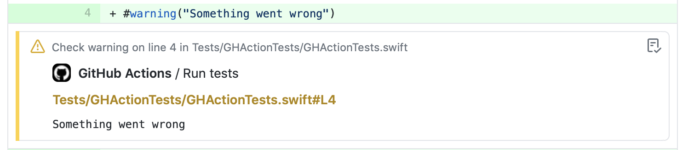

# 🛠 xc-gh ⚠️

Xcode logs formatter GitHub Action




## Installation

```bash
brew tap Alexander-Ignition/xc-gh https://github.com/Alexander-Ignition/xc-gh.git
brew install xc-gh
```

## Usage

### Swift package manager

```bash
$ set -o pipefail && swift test 2>&1 | xc-gh
```

### xcodebuild

```bash
$ set -o pipefail && xcodebuild [flags] 2>&1 | xc-gh
```
