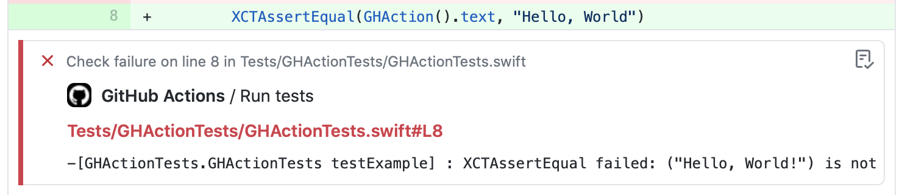

# 🛠 xc-gh ⚠️

Xcode logs formatter GitHub Action




## Installation

TODO: brew

## Usage

### Swift package manager

```bash
$ set -o pipefail && swift test 2>&1 | xc-gh
```

### xcodebuild

```bash
$ set -o pipefail && xcodebuild [flags] 2>&1 | xc-gh
```
